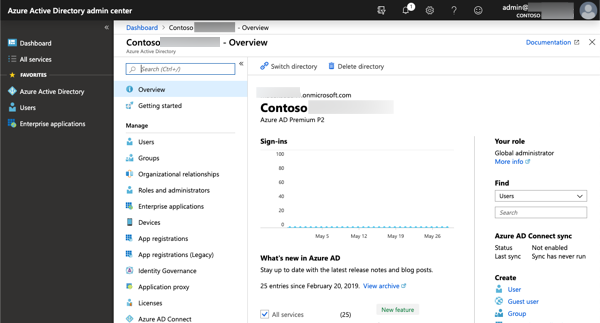
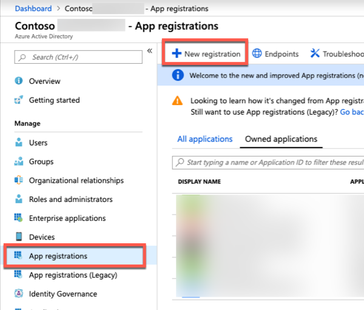

<!-- markdownlint-disable MD002 MD041 -->

In dieser Übung erstellen Sie eine neue Azure AD-Webanwendungs Registrierung mithilfe des Azure Active Directory Admin Center und erteilen dem Administrator die Zustimmung zu den erforderlichen Berechtigungs Bereichen.

1. Öffnen Sie einen Browser, und navigieren Sie zum [Azure Active Directory Adminhttps://aad.portal.azure.com)Center (](https://aad.portal.azure.com). Melden Sie sich mit einem **geschäftlichen oder Schulkonto**an.

1. Wählen Sie in der linken Navigationsleiste **Azure Active Directory** aus, und wählen Sie dann **App** -Registrierungen unter **Manage**aus.

    

1. Wählen Sie **Neue Registrierung** aus. Auf der Seite " **Anwendung registrieren** "

    

    Legen Sie die Werte wie folgt fest:

    - **Name**: GraphNotificationTutorial
    - **Unterstützte Kontotypen**: Konten in einem Organisations Verzeichnis und persönlichen Microsoft-Konten
    - Umleitungs- **URI**: Web#a0http://localhost

    

    Wählen Sie **registrieren**aus.

1. Kopieren Sie auf der Seite **GraphNotificationTutorial** den Wert der Anwendungs-ID **(Client)** und **Verzeichnis (** Mandanten-ID), speichern Sie ihn, benötigen Sie diese im nächsten Schritt.

    

1. Wählen Sie **#a0 Zertifikate verwalten #a1 Geheimnisse**aus. 

    Wählen Sie **neuer geheimer Client Schlüssel**aus.

    Geben Sie einen Wert in **Description** ein, und wählen Sie eine der Optionen für **Ablaufdatum** aus, und wählen Sie **Hinzufügen**aus.

    

    

1. Kopieren Sie den Wert des geheimen Clientschlüssels, bevor Sie diese Seite verlassen. Sie benötigen ihn im nächsten Schritt.

    > [!IMPORTANT]
    > Dieser geheime Clientschlüssel wird nicht noch einmal angezeigt, stellen Sie daher sicher, dass Sie ihn jetzt kopieren.

    

1. Wählen Sie **#a0 API-Berechtigungen verwalten**aus.

    Wählen Sie **Berechtigung hinzufügen** aus, und wählen Sie **Microsoft Graph**aus.

    

    Wählen Sie **Anwendungsberechtigung**aus, erweitern Sie die **Benutzer** Gruppe, und wählen Sie **Benutzer. ReadWrite. all** aus.

    Wählen Sie **Berechtigungen hinzufügen** aus, um Ihre Änderungen zu speichern.

    

    

Die Anwendung fordert eine Anwendungsberechtigung mit dem **Benutzer. ReadWrite. all** -Bereich an. Für diese Berechtigung ist eine administrative Zustimmung erforderlich.

Wählen Sie **Administrator Zustimmung für Contoso erteilen**aus, und wählen Sie **Ja** aus, um dieser Anwendung zuzustimmen, und gewähren Sie der Anwendung den Zugriff auf ihren Mandanten mithilfe der von Ihnen angegebenen Bereiche.

