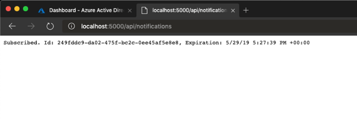
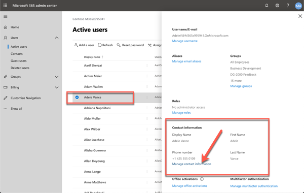

<!-- markdownlint-disable MD002 MD041 -->

Erstellen Sie eine Startkonfiguration, um die Anwendung in Visual Studio Code zu debuggen.

Wählen Sie in Visual Studio Code die Option **Debug #a0 Open Configurations**aus.

  

Wenn Sie zur Auswahl einer Umgebung aufgefordert werden, wählen Sie **.net Core**aus.

  

> [!NOTE]
> Standardmäßig wird die .net Core-Startkonfiguration einen Browser öffnen und zur Standard-URL für die Anwendung navigieren, wenn der Debugger gestartet wird. Für diese Anwendung möchten wir stattdessen zur NGrok-URL navigieren. Wenn Sie die Startkonfiguration unverändert lassen, wird jedes Mal, wenn Sie die Anwendung debuggen, eine fehlerhafte Seite angezeigt. Sie können die URL einfach ändern oder die Startkonfiguration so ändern, dass der Browser nicht gestartet wird:

Aktualisieren der Startkonfiguration für Visual Studio Debugger:

  1. Öffnen Sie in Visual Studio Code die Datei **. vscode/Launch. JSON**.
  1. Suchen Sie den folgenden Abschnitt in der Standardkonfiguration:

      ```json
      "launchBrowser": {
        "enabled": true
      },
      ```

  1. Legen Sie `enabled` die- `false`Eigenschaft auf fest.
  1. Speichern Sie Ihre Änderungen.

### <a name="test-the-application"></a>Testen Sie die Anwendung:

Klicken Sie in Visual Studio Code auf **Debuggen #a0 Debuggen starten** , um die Anwendung auszuführen. Im vs-Code wird die Anwendung erstellt und gestart.

Wenn im Fenster **Debug Console** Folgendes angezeigt wird...


... Öffnen Sie einen Browser, und **http://localhost:5000/api/notifications** navigieren Sie zu, um Änderungsbenachrichtigungen zu abonnieren. Bei erfolgreicher Ausführung wird eine Ausgabe mit einer Abonnement-ID wie die folgende angezeigt:



Ihre Anwendung abonniert jetzt Benachrichtigungen von Microsoft Graph, wenn ein Update für alle Benutzer im Office 365 Mandanten vorgenommen wird.

Eine Benachrichtigung auslösen:

1. Öffnen Sie einen Browser, und navigieren Sie zum [Microsoft 365 adminhttps://admin.microsoft.com/AdminPortal)Center (](https://admin.microsoft.com/AdminPortal).
1. Wenn Sie zur Anmeldung aufgefordert werden, melden Sie sich mit einem Administratorkonto an.
1. Wählen Sie **Benutzer #a0 aktive Benutzer**aus.

    

1. Wählen Sie einen aktiven Benutzer aus, und wählen Sie **Bearbeiten** als **Kontaktinformationen**aus.

    

1. Aktualisieren Sie den Wert der **Telefonnummer** mit einer neuen Nummer, und wählen Sie **Speichern**aus.

    In der Visual Studio-Code- **Debug-Konsole**wird eine Benachrichtigung empfangen. Manchmal kann es einige Minuten dauern, bis Sie eintreffen. Ein Beispiel für die Ausgabe ist unten:

    ```shell
    Received notification: 'Users/7a7fded6-0269-42c2-a0be-512d58da4463', 7a7fded6-0269-42c2-a0be-512d58da4463
    ```

Dadurch wird angegeben, dass die Anwendung die Benachrichtigung vom Microsoft Graph erfolgreich für den in der Ausgabe angegebenen Benutzer erhalten hat. Anschließend können Sie diese Informationen verwenden, um die Microsoft Graph-Daten für die Benutzer vollständig abzufragen, wenn Sie Ihre Details in Ihrer Anwendung synchronisieren möchten.